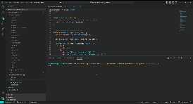

# README Generator

## Description

A command-line application to dynamically generate a high-quality, professional README.md file from the user's input.

The application will be invoked by using the following command:

## License

  
 This application is covered under the MIT license

## Table of Contents

1. [Description](#description)
2. [License](#license)
3. [Technologies](#technologies)
4. [Installation](#installation)
5. [Usage](#usage)
6. [Questions](#questions)

## Technologies

## Installation

You can install the project on your local machine by cloning or downloading the repository.

To install dependencies, run npm i in the terminal.

## Usage

Enter `$ node index.js` in the terminal to start the application. Once you have completed the prompts, your results will be logged to the console and written to 'README.md'.

The app's functionality should resemble the following:

## Questions

If you have any questions you can contact me on [github](https://github.com/georgiehackett)
